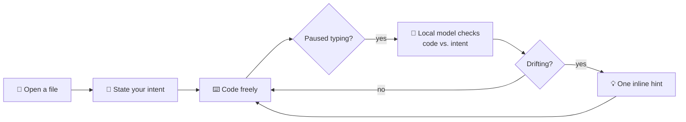

<div align="center">

<h1>🥋 Sensei</h1>

<p><strong>The coding mentor that lives in your editor.</strong></p>

<p><em>Sensei watches you code, understands your intent, and nudges you with a hint<br>the moment you drift — without ever writing the code for you.</em></p>

<p>Not autocomplete. Not a chatbot. A teacher. 100% local.</p>

<p>
  <a href="https://code.visualstudio.com/"></a>
  <a href="https://ollama.com"></a>
  <a href="https://www.typescriptlang.org/"></a>
  <a href="./LICENSE"></a>
  <a href="#-your-code-never-leaves-your-machine"></a>
</p>

<p>
  <a href="#-features">Features</a> ·
  <a href="#-how-it-works">How it works</a> ·
  <a href="#-getting-started">Getting started</a> ·
  <a href="#-model-tiers">Models</a> ·
  <a href="#-commands--settings">Commands</a>
</p>

</div>

---

## The problem

Modern AI coding tools are *too* helpful. You press <kbd>Tab</kbd>, an entire block appears, and you move on — never quite understanding **why**. The code ships, but the learning doesn't. And when the tool is wrong, you can't tell.

Sensei takes the opposite stance.

> You learn by doing, not by being told the answer.

It stays silent while you work, and speaks only when you're heading the wrong way — with a **question**, not a solution.

---

## ✨ Features

| | |
|---|---|
| 🎯 **Intent-aware** | Tell Sensei what each file is for. It judges your code against *your* goal, not a generic one. |
| 🤫 **Silent by default** | No pop-ups, no noise. Sensei speaks only when it's genuinely confident you've drifted. |
| 💡 **Hints, never code** | A single underline on the offending line: *"Do you really need a second loop here?"* You solve it. |
| 🔒 **Fully local** | Runs entirely on your machine via [Ollama](https://ollama.com). No accounts, no telemetry, no cloud. |
| ⚙️ **Right-sized models** | Auto-recommends a model tier based on your available RAM — from 0.5B on a laptop to 3B on a workstation. |
| 🪶 **Featherweight** | A quiet status-bar presence and inline diagnostics. It gets out of your way. |

---

## 🧭 How it works



1. **Open a file** and Sensei asks: *"What are we building here?"*
2. **Answer in one line** — `writing a REST endpoint to create users`, `solving quicksort`, anything.
3. **Code.** Sensei watches quietly, analyzing only when you pause.
4. **Drift, and you get one hint** on the exact line — a nudge toward the answer, never the answer itself.

---

## 🚀 Getting started

### 1. Install Ollama

Sensei runs on a local model served by [Ollama](https://ollama.com).

```bash
# macOS / Linux
curl -fsSL https://ollama.com/install.sh | sh

# then start the server
ollama serve
```

### 2. Install Sensei

Grab it from the VS Code Marketplace, or install the `.vsix` directly:

```bash
code --install-extension sensei-*.vsix
```

### 3. First launch

On first run, Sensei detects your hardware, recommends a model, and downloads it for you.
That's it — open a file and start coding.

---

## 🧩 Model tiers

Sensei picks the best fit for your machine automatically. You can override it anytime.

| Tier | Model | Recommended RAM |
|------|-------|:---------------:|
| **Minimum** | `qwen2.5-coder:0.5b` | ≤ 4 GB |
| **Average** | `qwen2.5-coder:1.5b` | 4–8 GB |
| **Good** | `qwen2.5-coder:3b` | 8 GB+ |

---

## 🎛️ Commands & settings

**Commands** (open the palette with <kbd>Ctrl/Cmd</kbd>+<kbd>Shift</kbd>+<kbd>P</kbd>):

| Command | Description |
|---------|-------------|
| `Sensei: Set Intent` | Set or update what you're building in the current file. |
| `Sensei: Reset Session` | Clear the intent for the current file. |

**Settings:**

| Setting | Description |
|---------|-------------|
| `sensei.model` | The Ollama model Sensei uses for analysis (set during first-run setup). |

---

## 🔐 Your code never leaves your machine

Everything — intent tracking, code analysis, hint generation — happens **locally** through Ollama. Sensei makes no network calls to any third-party service. No API keys. No accounts. No telemetry. Your code is yours.

---

## 🙌 Contributing

Contributions are welcome. Open an issue to discuss an idea, or send a pull request. Please keep changes focused and include a clear description of the behavior you're changing.

```bash
git clone https://github.com/akshajtiwari/Sensei.git
cd Sensei
npm install
npm run compile   # build
npm test          # run the suite
# press F5 in VS Code to launch the Extension Development Host
```

---

## 📜 License

Released under the [Apache License 2.0](./LICENSE).

<div align="center">
<br>

**Sensei will never write your code. It will never solve your bug.**
**It will only ask you to think harder — in the right direction.**

<br>

⭐ If Sensei helps you grow as a developer, consider starring the repo.

</div>
