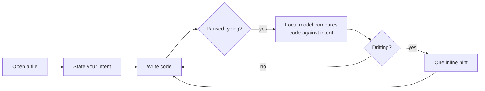

<div align="center">

<h1>Sensei</h1>

<p><strong>A coding mentor for your editor.</strong></p>

<p>Sensei observes your code, understands what you set out to build, and offers a single<br>
hint the moment you drift — without ever writing the code for you.</p>

<p>
  <a href="https://code.visualstudio.com/"></a>
  <a href="https://ollama.com"></a>
  <a href="https://www.typescriptlang.org/"></a>
  <a href="./LICENSE"></a>
</p>

<p>
  <a href="#overview">Overview</a> ·
  <a href="#how-it-works">How it works</a> ·
  <a href="#getting-started">Getting started</a> ·
  <a href="#models">Models</a> ·
  <a href="#configuration">Configuration</a>
</p>

</div>

---

## Overview

Modern AI coding tools are optimized to write code for you. You accept a suggestion, the block
appears, and you move on — often without understanding why it works, and unable to tell when it
is wrong. The code ships, but the understanding does not.

Sensei is built on the opposite premise: **you learn by doing, not by being told the answer.**
It stays out of the way while you work and speaks only when you are heading in the wrong
direction — with a question, not a solution. Everything runs locally through
[Ollama](https://ollama.com); no code leaves your machine.

## Features

- **Intent-aware.** You state what each file is for, and Sensei evaluates your code against
  that goal rather than a generic notion of correctness.
- **Silent by default.** No pop-ups and no noise. Sensei surfaces a hint only when it is
  confident you have drifted.
- **Hints, never code.** Feedback arrives as a single inline note on the relevant line — for
  example, *"Do you need a second loop here?"* — leaving the solution to you.
- **Fully local.** Analysis runs on your own hardware via Ollama. No accounts, no telemetry,
  no network calls to third-party services.
- **Hardware-aware models.** Sensei recommends a model sized to your available memory, from a
  0.5B model on a laptop to a 3B model on a workstation.
- **Unobtrusive.** A quiet status-bar indicator and standard editor diagnostics — nothing more.

## How it works


```mermaid
flowchart LR
    A[Open a file] --> B[State your intent]
    B --> C[Write code]
    C --> D{Paused typing?}
    D -- yes --> E[Local model compares<br/>code against intent]
    E --> F{Drifting?}
    F -- no --> C
    F -- yes --> G[One inline hint]
    G --> C 
```

1. When you open a file, Sensei asks what you intend to build.
2. You answer in a single line — for example, `a REST endpoint to create users` or
   `implement quicksort`.
3. As you write, Sensei observes quietly and analyzes only when you pause.
4. If your code drifts from the stated intent, Sensei places one hint on the relevant line — a
   nudge toward the answer, never the answer itself.

## Getting started

### Prerequisites

Sensei requires [Ollama](https://ollama.com) running locally and VS Code 1.85 or newer.

```bash
# Install Ollama (macOS / Linux)
curl -fsSL https://ollama.com/install.sh | sh

# Start the Ollama server
ollama serve
```

### Installation

Install from the VS Code Marketplace, or install a packaged build directly:

```bash
code --install-extension sensei-*.vsix
```

### First run

On first launch, Sensei inspects your hardware, recommends an appropriate model, and downloads
it. Once setup completes, open a file and begin working.

## Models

Sensei selects a model tier based on available memory and lets you override the choice at any
time.

| Tier    | Model                | Recommended memory |
| ------- | -------------------- | ------------------ |
| Minimum | `qwen2.5-coder:0.5b` | 4 GB or less       |
| Average | `qwen2.5-coder:1.5b` | 4–8 GB             |
| Good    | `qwen2.5-coder:3b`   | 8 GB or more       |

## Configuration

**Commands** (Command Palette — <kbd>Ctrl/Cmd</kbd>+<kbd>Shift</kbd>+<kbd>P</kbd>):

| Command                 | Description                                          |
| ----------------------- | ---------------------------------------------------- |
| `Sensei: Set Intent`    | Set or update what you are building in the file.     |
| `Sensei: Reset Session` | Clear the intent associated with the current file.   |

**Settings:**

| Setting        | Description                                                             |
| -------------- | ---------------------------------------------------------------------- |
| `sensei.model` | The Ollama model used for analysis, set during first-run setup.        |

## Privacy

Intent tracking, code analysis, and hint generation all run locally through Ollama. Sensei makes
no requests to third-party services and collects no telemetry. Your code stays on your machine.

## Contributing

Contributions are welcome. Open an issue to discuss a change, or submit a pull request with a
clear description of the behavior it introduces.

```bash
git clone https://github.com/akshajtiwari/Sensei.git
cd Sensei
npm install
npm run compile   # build
npm test          # run the test suite
```

Press <kbd>F5</kbd> in VS Code to launch the Extension Development Host.

## License

Sensei is released under the [Apache License 2.0](./LICENSE).
